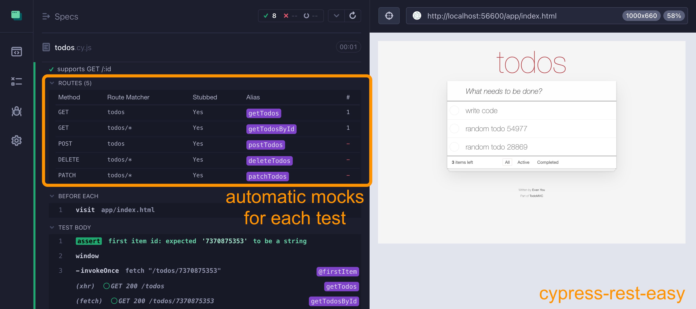
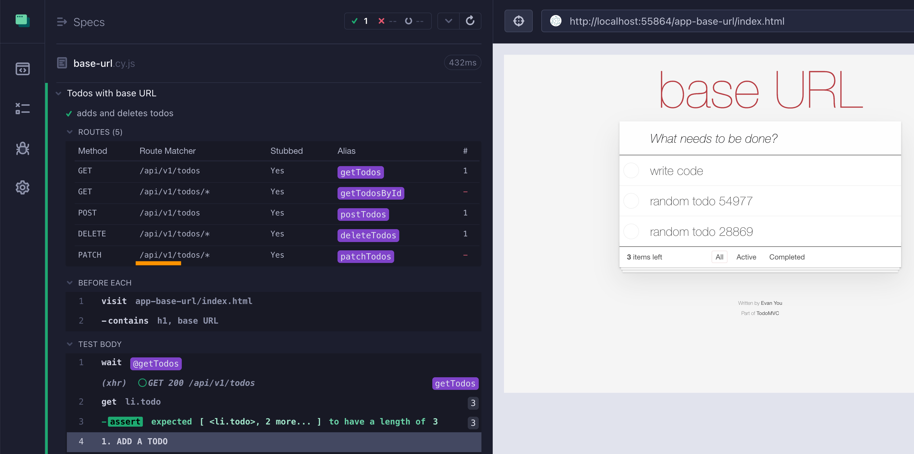

# cypress-rest-easy

> Quickly creates REST mocks for your Cypress tests

## Install

```bash
$ npm i -D cypress-rest-easy
```

Add this plugin to your support / spec file

```js
// https://github.com/bahmutov/cypress-rest-easy
import 'cypress-rest-easy'
```

## Use

### rest

Declare the REST endpoints in the `describe` / `it` configuration block

```js
// "todos.json" is a Cypress fixture file
describe('Todos', { rest: { todos: 'todos.json' } }, () => {
  // each test will have mock backend with the following endpoints
  // GET /todos
  // GEt /todos/:id
  // POST /todos
  // DELETE /todos/:id
  // PATCH /todos/:id
```

The above syntax creates automatic intercepts with aliases:



The fixture file should be an array of items.

See [todos.cy.js](./cypress/e2e/todos.cy.js) and [todos.json](./cypress/fixtures/todos.json) for examples

The mocks and data are reset before each test.

### data access

You can get the "live" data for each resource by name, for example

```js
it('adds a todo', { rest: { todos: 'todos.json' } }, () => {
  // use the REST resource name
  const todos = Cypress.env('todos')
  const n = todos.length
  cy.visit('/')
  cy.get('li.todo').should('have.length', n)
  cy.get('input.new-todo')
    .type('Write tests{enter}')
    // there should be one more item in the array
    .then(() => {
      expect(todos).to.have.length(n + 1)
    })
})
```

You need `cy.then` to access the changed data _after_ Cypress commands have finished. Alternatively, you can wrap the array reference:

```js
cy.get('input.new-todo')
  .type('Write tests{enter}')
// there should be one more item in the array
cy.wrap(todos)
  .should('have.length', n + 1)
```

### baseUrl

If all your REST endpoints use the same prefix, you can set the `baseUrl` option

```js
describe(
  'Todos with base URL',
  { rest: { baseUrl: '/api/v1', todos: 'todos.json' } },
  () => {
```



## Small print

Author: Gleb Bahmutov &lt;gleb.bahmutov@gmail.com&gt; &copy; 2025

- [@bahmutov](https://twitter.com/bahmutov)
- [glebbahmutov.com](https://glebbahmutov.com)
- [blog](https://glebbahmutov.com/blog)
- [videos](https://www.youtube.com/glebbahmutov)
- [presentations](https://slides.com/bahmutov)
- [cypress.tips](https://cypress.tips)
- [Cypress Tips & Tricks Newsletter](https://cypresstips.substack.com/)
- [my Cypress courses](https://cypress.tips/courses)

License: MIT - do anything with the code, but don't blame me if it does not work.

Support: if you find any problems with this module, email / tweet /
[open issue](https://github.com/bahmutov/cypress-rest-easy/issues) on Github
